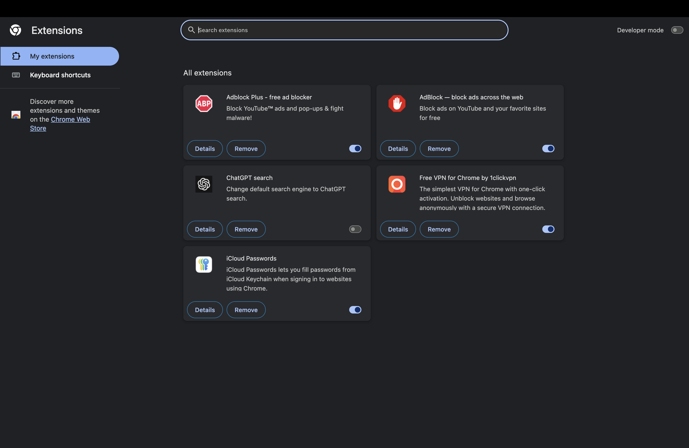

# 🛡️ Cyber Security Internship – Task 7

## 🔍 Task: Identify and Remove Suspicious Browser Extensions

### 🖥️ Device & Environment:
- **Device:** MacBook
- **Browser:** Google Chrome (macOS)
- **Date:** 5th June 2025

---

## 🎯 Objective:
To enhance browser security by identifying and removing potentially suspicious or unused Chrome extensions.

---

## 📸 Screenshot Before Cleanup:

---

## 📋 Steps Performed:

1. Opened Chrome’s Extensions Manager via `chrome://extensions`.
2. Reviewed the installed extensions.
3. Evaluated each based on:
   - **Purpose**
   - **Permissions**
   - **Reviews/online reputation**
4. Identified unused or potentially suspicious extensions.
5. Removed extensions deemed unnecessary or risky.
6. Restarted browser and observed performance.

---

## 📦 Extensions Reviewed:

| Extension Name             | Status     | Notes                                                       |
|---------------------------|------------|-------------------------------------------------------------|
| Adblock Plus              | Kept       | Trusted, widely used ad blocker.                           |
| AdBlock                   | Kept       | Also trusted, similar to Adblock Plus.                     |
| ChatGPT Search            | **Removed**| Not actively used, modifies search engine – unnecessary.   |
| Free VPN by 1clickvpn     | **Removed**| Free VPNs may pose security risks, not from a known vendor.|
| iCloud Passwords          | Kept       | Trusted extension by Apple for keychain integration.       |

---

## ✅ Outcome:
- Removed unused and potentially risky extensions (`ChatGPT Search`, `Free VPN`).
- Browser feels lighter and more responsive.
- Gained better awareness of extension permissions and risks.
